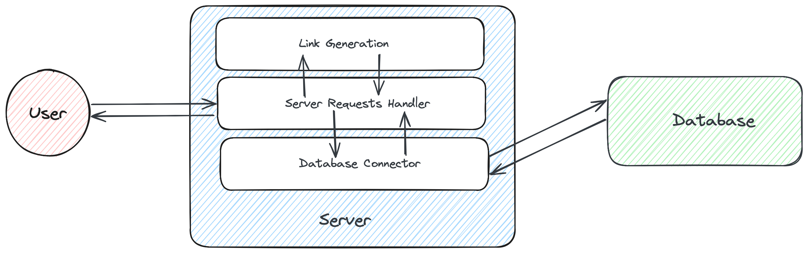

# tinyURL

A link shortener service that uses a sequential hashing algorithm to generate a unique short url and uses a postgresql
database with an in-memory cache.

## Startup

1. Start postgresql server using Docker and create database using below command. This picks the username, password and
   other parameters from default config file: [local-run-config.yaml](resources/config/local-run-config.yaml)
    ```bash
   # Interactive query will require user to enter password for connecting to DB
    bash resources/config/setup-psql.sh 
   ```
   For custom config file:
   ```bash
   # Pass in custom config file to override default config file at resources/config/local-run-config.yaml
   bash resources/config/setup-psql.sh <custom-config-file>
    ```
2. Start the server using:
   ```bash
   go build
   ./tinyURL
   ```

3. Make Request:
    ```bash
   # POST request to shorten a url
   curl -X POST -H "Content-Type: application/json" -d '{"url": "https://google.com"}' http://localhost:8080/
   ```

4. Check redirection by hitting `localhost:8080/<short_url>` in browser

## Functional Requirements

1. Handle a maximum of 10 Billion unique URLs, with a read load of 1000 requests per second and a write load of 10
   requests per second.
2. URLs should be persisted indefinitely.
3. No custom URLs, just auto-generated short URLs.
4. Delete and edit is not required.

## Design



There are 3 major components in the system:

1. **Link Generator**: Generates a unique short url for a given url
2. **Link Store**: Stores the short url and the original url in a database
3. **Server Handler**: Handles the request from the client and redirects to the original url

## Link Generator

We have 2 ways to go about this:

1. Use an existing hashing algorithm: SHA-256 and take the first n characters of the hash as the short url.
    1. Handling collisions can be tricky. We can start off with short url length as 8, so 64^8 (~2e14) combinations,
       this will reduce the number of probability of collisions.
    2. Handle collisions by picking a random character from the hash and assigning random character with 10 retries.
2. Use a sequential hashing algorithm: Keep a counter and increment it for every new url. Convert the counter to base64
   to get the short url.
    1. Counter can be stored in a database and incremented for every new url. This is necessary when we have multiple
       machines running the service.

|                       | Pros                                        | Cons                                                                                      |
|-----------------------|---------------------------------------------|-------------------------------------------------------------------------------------------|
| SHA-256 Generator     | No security concerns about being predictive | Handling collisions can be tricky                                                         |
| Sequential  Generator | No collision handling is required.          | Sequential hashing is predictable and can be used to enumerate all the urls in the system |

## Link Store

We have 2 ways to go about this. In both cases, we can use an in-memory cache to store the short url and original url.
This will help us in reducing the number of reads from the database.

1. Use SQL Database, for e.g. PSQL. (Using this)
2. USe NoSQL Key-value store like

|            | Pros                                                                       | Cons                                                                                                                          |
|------------|----------------------------------------------------------------------------|-------------------------------------------------------------------------------------------------------------------------------|
| PostgreSQL | ACID properties are followed. Concurrent read/writes can be handled easily | Horizontal scaling is difficult for SQL databases                                                                             |
| Cassandra  | Horizontal scaling should be seamless.                                     | ACID properties are not followed. How do we make sure the data is consistent and concurrent read/writes are handled properly? |

PSQL Table Structure:

```sql
 CREATE TABLE short_links
 (
     short_link    VARCHAR(10) PRIMARY KEY,
     original_link VARCHAR(5000) NOT NULL
 );
CREATE INDEX original_link_index ON short_links (original_link);
```

For Sequential Hashing Generator, we can use a counter_table to store the counter value. This can be done using:

```sql
 CREATE TABLE counter_table
 (
     counter_value BIGINT PRIMARY KEY
 );
```

## Interesting Questions

1. We aren't supporting 10 billion unique URLs from the start. So, how do we assign memory incrementally to the DB?
2. How to address security concerns of sequential link generation?