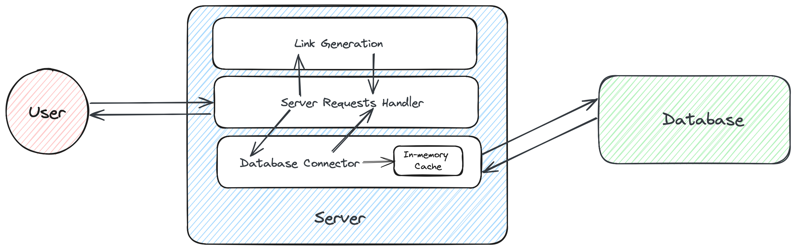

## tinyURL

A link shortener service that uses a sequential hashing algorithm to generate a unique short url for a given url and
stores in postgresql database with a in-memory cache.

## Design



## Startup

1. Start postgresql server using Docker and create database using below command. This picks the username, password and
   other parameters from default config file: [local-run-config.yaml](resources/config/local-run-config.yaml)
    ```bash
   # Interactive query will require user to enter password for connecting to DB
    bash resources/config/setup-psql.sh 
   ```
   For custom config file:
   ```bash
   # Pass in custom config file to override default config file at resources/config/local-run-config.yaml
   bash resources/config/setup-psql.sh <custom-config-file>
    ```
2. Make Request:
    ```bash
   # POST request to shorten a url
   curl -X POST -H "Content-Type: application/json" -d '{"url": "https://google.com"}' http://localhost:8080/
   ```
3. Check redirection by hitting `localhost:8080/<short_url>` in browser

## Todo

1. Address security concerns of sequential hashing